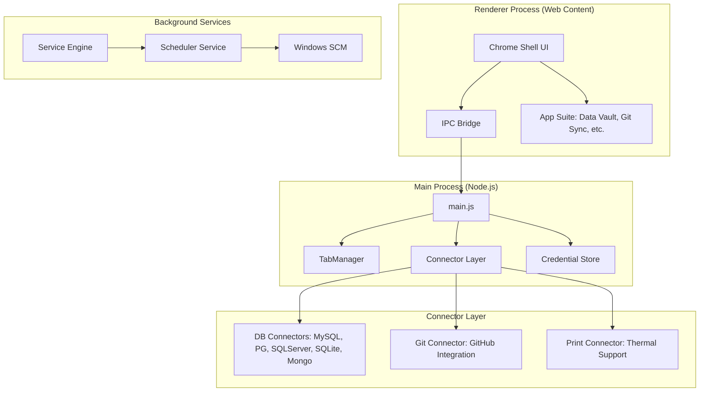

# MoBrowser (MuulBrowser)

MoBrowser is a high-performance, developer-centric Electron browser shell. Beyond standard web browsing, it integrates a powerful suite of developer utilities including database connectors, Git synchronization, and a background task scheduler.

## 🏗️ System Architecture

MoBrowser utilizes a modular architecture that separates the UI shell from core service logic, enabling high extensibility.

### Core Components
- **Main Process**: Coordinates window lifecycle, tab management via `WebContentsView`, and bridges specialized connectors.
- **Tab Manager**: A modern implementation using `WebContentsView` for better performance and compositing compared to traditional `BrowserView`.
- **Connector Layer**: A pluggable system for interacting with external services (DB, Git, Printers).
- **Service Engine**: A standalone-capable engine for running scheduled background tasks as a Windows Service.



---

## 📚 Feature Encyclopedia

### 🌐 Browsing & Navigation
- **Tabbed Engine**: Advanced tab management with pinning, reordering, and state persistence.
- **Smooth Navigation**: Custom back/forward/reload logic with predictive search suggestions.
- **Bookmarks Studio**: Categorized bookmarking (Bar vs. Folders) with favicon support.
- **Smart Context Menu**: Context-aware right-click actions for links, images, and text selection.

### 🔐 Security & Credentials
- **Unified Credential Vault**: Securely manages DB, Git, and generic secrets using OS-level encryption (`keytar`).
- **Identity Manager**: Profile-based sign-in and session management.
- **Handshake Protocol**: Native "Codex Handshake" for verifying trusted communication paths.

### 🛠️ Developer Suite
- **DB Data Vault**: Native connectors for PostgreSQL, MySQL, SQL Server, SQLite, and MongoDB.
- **Git Sync**: Integrated GitHub manager for pushing/pulling payloads directly from the browser.
- **Print Studio**: Precision printing logic with specialized support for thermal printer protocols.
- **DevTools Hub**: Independent DevTools instances for the chrome and individual tabs.

### ⚙️ Automation & Services
- **Background Scheduler**: Schedule recurring tasks (DB queries, downloads, Git syncs).
- **Service Runner**: Headless execution mode for running the browser's logic as a system service.
- **Auto-Updater**: Seamless background updates via `electron-updater`.

---

## 📁 Project Directory Structure

```text
mobrowser/
├── build/                  # Application icons and installer scripts
├── scheduler-service/      # Windows Service installation scripts
├── service-runner/         # Headless service entry point
├── src/
│   ├── main/               # Electron Main Process
│   │   ├── connectors/     # Pluggable service connectors (DB, Git, Print)
│   │   ├── scheduler/      # Task scheduling and runner logic
│   │   ├── windows/        # Controller logic for various UI windows
│   │   └── tabManager.js   # Advanced Tab lifecycle management
│   ├── preload/            # Context-isolated bridge scripts
│   └── renderer/           # UI Chrome Shell (HTML/CSS/JS)
│       ├── assets/         # Styles, icons, and themes
│       ├── scripts/        # Frontend logic and components
│       └── [modules]/      # Feature-specific UI (bookmarks, git, etc.)
├── test/                   # Jest unit and integration tests
└── vendor/                 # Native dependency stubs
```

---

## 🚨 Production Readiness Score: 68/100

While MoBrowser is feature-complete and architecturally sound, it is currently in a **"Developer Preview"** phase. To reach 90+ for public production release, the following critical areas must be addressed:

### 📊 Readiness Breakdown
| Category | Score | Rationale |
| :--- | :--- | :--- |
| **Architecture** | 92% | Excellent modular connector design & headless service runner. |
| **Features** | 95% | Comprehensive toolset (DB, Git, Scheduler, Vault) is industry-grade. |
| **Build & Release** | 85% | Automated updates & Windows Service support. |
| **Security** | 45% | **Critical Blocker**: Requires strict origin validation for IPC bridges to prevent malicious site access to local DBs. |
| **Stability (UX)** | 65% | Hitbox and DPI scaling issues on 1080p laptops need finalizing. |

---

## 🔐 Security Architecture & Vault
MoBrowser is designed to handle sensitive developer credentials. Safety is our top priority.

- **System-Level Encryption**: We leverage **AES-256** and the **System Keychain** (via `keytar`). Your Database and Git tokens are never stored in plain text; they are locked in the Windows Credential Manager or macOS Keychain.
- **Context Isolation**: The renderer is completely isolated from the main process. Communication happens only through a vetted "Handshake" bridge in `preload.js`.
- **Zero-Persistence Policy**: Sensitive session data for services like GitHub is cleared immediately upon logout or session expiry.

> [!WARNING]
> **Current Security Advisory**: The `MessageHandler` currently lacks strict origin filtering. Ensure you only browse trusted internal domains if local database connectors are active.

---

## 🖥️ Display & Compatibility
MoBrowser features a high-performance **Frameless UI**.

### Windows DPI Scaling
On 1080p laptop screens, Windows default scaling (125%/150%) can cause "spillover" where the window content extends 8 pixels beyond the screen edge.
- **The Fix**: The application automatically detects "Maximized" states to adjust internal margins, ensuring window controls (Minimize/Maximize) remain accessible and clickable at the monitor's edge.

---

## 🚀 Future Roadmap & Hardening
To achieve 100% production readiness:
1. **Origin Hardening**: Implement a whitelist for domains that can interact with the SQL bridge.
2. **Audit Logs**: Add a local-only audit log for whenever a database credential is accessed.
3. **Multi-Platform Services**: Bring the Windows Scheduler Service to macOS (`launchd`) and Linux (`systemd`).

---

## 🔌 Local Config Connector - How It Works

MoBrowser includes a **Local Config Connector** that allows webpages to interact with local folder configurations using the same connector pattern as database and Git operations.

### Architecture Flow

```
Browser (webpage) → messageHandler → ConnectorFactory → LocalConfigConnector → LocalConfigService
```

### Step-by-Step Process

1. **Browser Sends Request**:
   ```javascript
   window.postMessage({
     type: 'GET_LOCAL_CONFIG',  // or 'GET_FOLDER_DETAILS'
     requestId: 'unique-id'
   }, '*');
   ```

2. **MessageHandler Receives**:
   - `messageHandler.js` receives the external message
   - Extracts the `type` field
   - Calls `ConnectorFactory.create(type)`

3. **ConnectorFactory Routes**:
   - Matches type in switch statement:
     - `GET_LOCAL_CONFIG` → Returns `LocalConfigConnector` instance
     - `GET_FOLDER_DETAILS` → Returns `LocalConfigConnector` instance

4. **LocalConfigConnector Executes**:
   - Creates `LocalConfigService` instance
   - Calls appropriate service method based on action

5. **LocalConfigService Does the Work**:
   - `GET_LOCAL_CONFIG`: Reads `local-config.json` from userData directory
   - `GET_FOLDER_DETAILS`: Lists files/folders in configured path
   - Returns data back through the chain

### Supported Actions

| Action | Description | Returns |
|--------|-------------|---------|
| `GET_LOCAL_CONFIG` | Retrieves saved folder configuration | `{ folderPath, folderName }` |
| `GET_FOLDER_DETAILS` | Lists contents of configured folder | `{ folderPath, folderName, contents: [...] }` |

### Example Response

```javascript
{
  success: true,
  data: {
    folderPath: "C:\\Users\\HP\\Documents\\GitHub",
    folderName: "mobrowser",
    contents: [
      { name: "src", type: "folder" },
      { name: "package.json", type: "file", size: 2582 }
    ]
  }
}
```

### Files Involved

- **`src/main/connectors/LocalConfigConnector.js`**: Action dispatcher
- **`src/main/connectors/ConnectorFactory.js`**: Routes requests to appropriate connector
- **`src/main/LocalConfigService.js`**: Handles file I/O and folder operations
- **`src/main/messageHandler.js`**: Entry point for external messages

---

---

## 🚀 Getting Started

### Prerequisites (Windows)
- **Node.js**: Version 16.x or higher is required.
- **Git**: For version control integration.
- **Build Tools**: Because MoBrowser uses native modules (like `sqlite3` and `keytar`), you need a C++ build environment.
  - Run `npm install --global windows-build-tools` (from an Administrator Terminal) **OR** install Visual Studio with "Desktop development with C++".

### 📦 Key Dependencies
MoBrowser relies on several high-performance packages:
- **`electron`**: The core framework for the desktop experience.
- **`keytar`**: Securely handles system-level credential storage (Windows Vault).
- **`sqlite3`, `mysql2`, `pg`, `mssql`, `mongodb`**: Native drivers for multi-database connectivity.
- **`ssh2`**: For secure remote connections and IAM tunneling.
- **`cron-parser`**: Powering the advanced scheduling logic.
- **`electron-builder`**: Used for packaging and compiling native dependencies.

### 🛠️ Installation Steps

1. **Clone the repository**:
   ```bash
   git clone https://github.com/yogimehla/mobrowser.git
   cd mobrowser
   ```

2. **Install Packages**:
   ```bash
   npm install
   ```
   > [!IMPORTANT]
   > During `npm install`, the `postinstall` script will automatically run `electron-builder install-app-deps`. This re-compiles native modules (like SQLite) to match your local Electron version.

3. **Start Development**:
   ```bash
   npm start
   ```

### Building
- `npm run build:win`: Creates a packaged installer in `/dist`.
- `npm run build:scheduler-service`: Packages the headless service runner.

---

## 📝 License
Proprietary - Muul Origins


