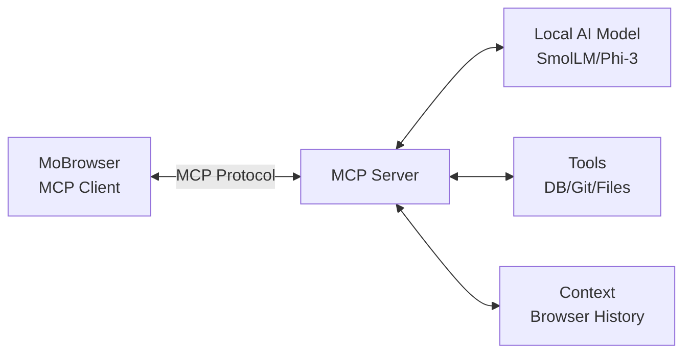
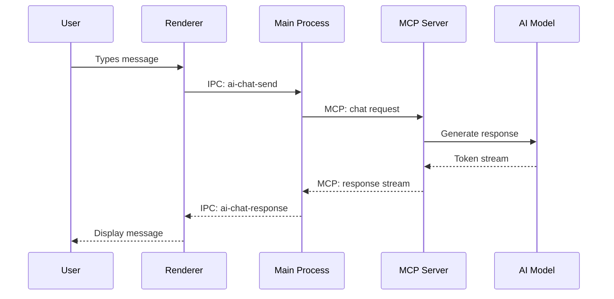

# AI Integration Concept for MoBrowser

## Table of Contents
1. [Overview](#overview)
2. [What is MCP (Model Context Protocol)?](#what-is-mcp)
3. [Downloadable AI Models](#downloadable-ai-models)
4. [Architecture Design](#architecture-design)
5. [Implementation Plan](#implementation-plan)
6. [Technical Details](#technical-details)
7. [Getting Started](#getting-started)

---

## Overview

This document outlines the concept and implementation strategy for integrating **AI chat capabilities** into MoBrowser using:

- **MCP (Model Context Protocol)** - For standardized AI communication
- **Downloadable AI models** - Free, local models like SmolLM, Phi-3, Llama, etc.
- **No cloud dependency** - Works offline with local models
- **Privacy-focused** - All data stays on your machine

**Key Benefits:**
- ✅ **Free** - No API costs or subscriptions
- ✅ **Private** - Data never leaves your computer
- ✅ **Offline** - Works without internet connection
- ✅ **Fast** - Local inference on your hardware
- ✅ **Customizable** - Choose your preferred model

---

## What is MCP (Model Context Protocol)?

### Definition

**MCP** is an open protocol created by Anthropic that standardizes how AI applications communicate with:
- **AI Models** (local or cloud)
- **Tools** (functions the AI can execute)
- **Context Sources** (files, databases, APIs)

Think of it as a "USB standard for AI" - one interface, many implementations.

### MCP Architecture



### Why MCP?

**Without MCP:**
```javascript
// Different integration for each AI provider
if (provider === 'openai') {
  // OpenAI-specific code
} else if (provider === 'anthropic') {
  // Anthropic-specific code
} else if (provider === 'local') {
  // Local model-specific code
}
```

**With MCP:**
```javascript
// One interface for all providers
const response = await mcpClient.sendMessage({
  role: 'user',
  content: 'Explain this code'
});
```

---

## Downloadable AI Models

### 1. SmolLM (Recommended for Starting)

**About:**
- Created by Hugging Face
- Tiny efficient models (135M - 1.7B parameters)
- Fast inference on CPU
- Great for coding assistance

**Variants:**
- `SmolLM-135M` - Ultra lightweight (CPU friendly)
- `SmolLM-360M` - Balanced performance
- `SmolLM-1.7B` - Best quality for small size

**Download:**
```bash
# Using Hugging Face Hub
huggingface-cli download HuggingFaceTB/SmolLM-1.7B-Instruct --local-dir ./models/smollm
```

**Model Size:** 
- 135M: ~270 MB
- 360M: ~720 MB  
- 1.7B: ~3.4 GB

### 2. Phi-3 (Microsoft)

**About:**
- High-quality small model from Microsoft
- Excellent for general chat and coding
- Optimized for edge devices

**Variants:**
- `Phi-3-mini-4k` - 3.8B parameters (~7.6 GB)
- `Phi-3-mini-128k` - Long context version

**Download:**
```bash
huggingface-cli download microsoft/Phi-3-mini-4k-instruct-gguf \
  --include "Phi-3-mini-4k-instruct-q4.gguf" \
  --local-dir ./models/phi3
```

### 3. Llama 3.2 (Meta)

**About:**
- Latest from Meta
- Very capable, good for complex tasks
- Larger but higher quality

**Variants:**
- `Llama-3.2-1B` - Smallest (~2 GB)
- `Llama-3.2-3B` - Balanced (~6 GB)

### 4. Qwen 2.5 (Alibaba)

**About:**
- Strong multilingual support
- Good coding capabilities
- Efficient architecture

**Variants:**
- `Qwen2.5-0.5B` - Ultra efficient (~1 GB)
- `Qwen2.5-1.5B` - Good balance (~3 GB)

### Model Formats

**GGUF Format** (Recommended):
- Quantized models (smaller size, faster)
- Works with llama.cpp
- Best for CPU inference

**Quantization Levels:**
- `Q4_K_M` - 4-bit quantization (recommended)
- `Q5_K_M` - 5-bit (better quality)
- `Q8_0` - 8-bit (near original quality)

---

## Architecture Design

### System Overview

```mermaid
graph TB
    subgraph "MoBrowser Main Process"
        A[AI Service Manager] --> B[MCP Client]
        A --> C[Model Loader]
        A --> D[Tool Registry]
    end
    
    subgraph "MCP Server Process"
        B <-->|JSON-RPC| E[MCP Server]
        E --> F[llama.cpp Engine]
        E --> G[Tool Executor]
        F --> H[Loaded Model<br/>SmolLM/Phi-3]
    end
    
    subggroup "Renderer Process"
        I[Chat UI] <-->|IPC| A
    end
    
    subgraph "Tools"
        G --> J[Database Query]
        G --> K[Git Operations]
        G --> L[File Search]
        G --> M[Web Search]
    end
```

### Component Breakdown

#### 1. **AI Service Manager** (Main Process)
```javascript
// src/main/aiService.js
class AIServiceManager {
  constructor() {
    this.mcpClient = null;
    this.currentModel = null;
    this.availableModels = [];
  }
  
  async loadModel(modelPath) {
    // Load model via MCP server
  }
  
  async chat(message, context) {
    // Send message to MCP server
  }
  
  async addTool(toolDef) {
    // Register new tool
  }
}
```

#### 2. **MCP Client** (Main Process)
```javascript
// Uses @modelcontextprotocol/sdk
import { Client } from '@modelcontextprotocol/sdk/client/index.js';
import { StdioClientTransport } from '@modelcontextprotocol/sdk/client/stdio.js';

const transport = new StdioClientTransport({
  command: 'node',
  args: ['./mcp-server/index.js']
});

const mcpClient = new Client({
  name: 'mobrowser-ai',
  version: '1.0.0'
}, { capabilities: {} });

await mcpClient.connect(transport);
```

#### 3. **MCP Server** (Separate Process)
```javascript
// mcp-server/index.js
import { Server } from '@modelcontextprotocol/sdk/server/index.js';
import { StdioServerTransport } from '@modelcontextprotocol/sdk/server/stdio.js';

const server = new Server({
  name: 'mobrowser-ai-server',
  version: '1.0.0'
}, {
  capabilities: {
    tools: {},
    prompts: {},
    resources: {}
  }
});

// Handle chat requests
server.setRequestHandler('chat', async (request) => {
  // Run inference with llama.cpp
});
```

#### 4. **Model Loader** (llama.cpp wrapper)
```javascript
// Uses node-llama-cpp
import { LlamaModel, LlamaContext, LlamaChatSession } from 'node-llama-cpp';

const model = new LlamaModel({
  modelPath: './models/smollm/model.gguf',
  gpuLayers: 0 // CPU only, set to auto for GPU
});

const context = new LlamaContext({ model });
const session = new LlamaChatSession({ context });
```

#### 5. **Chat UI** (Renderer)
```javascript
// Already exists: src/renderer/chat/
// Enhance existing chat drawer with AI capabilities

async function sendChatMessage(message) {
  const response = await window.browserBridge.aiChat(message);
  displayMessage(response);
}
```

---

## Implementation Plan

### Phase 1: Foundation (Week 1)

**1.1 Install Dependencies**
```bash
npm install @modelcontextprotocol/sdk
npm install node-llama-cpp
npm install @huggingface/hub
```

**1.2 Create MCP Server**
- Create `mcp-server/` directory
- Implement basic MCP server with llama.cpp
- Test with sample model

**1.3 Add AI Service Manager**
- Create `src/main/aiService.js`
- MCP client initialization
- Model loading logic

### Phase 2: Model Management (Week 2)

**2.1 Model Download UI**
```javascript
// New window: src/main/windows/aiModelsWindow.js
- List available models (SmolLM, Phi-3, etc.)
- Download progress tracking
- Model storage in userData/ai-models/
```

**2.2 Model Registry**
```javascript
// src/main/aiModelRegistry.js
- Store downloaded models metadata
- Quick model switching
- Model deletion/management
```

### Phase 3: Chat Integration (Week 3)

**3.1 Enhance Existing Chat UI**
- Connect to AI service instead of placeholder
- Streaming responses
- Message history

**3.2 Context Integration**
```javascript
- Access browser history for context
- Current page content
- Selected text from tabs
```

### Phase 4: Tool Integration (Week 4)

**4.1 Register Existing Tools**
```javascript
// Tools AI can use:
- Database queries
- Git operations  
- File search
- Web search
```

**4.2 Function Calling**
```javascript
// AI can execute:
async function executeTool(toolName, params) {
  // Route to existing connectors
}
```

---

## Technical Details

### MCP Protocol Flow



### Model Inference Pipeline

```javascript
// In MCP Server
async function generateResponse(prompt, options = {}) {
  // 1. Format prompt with chat template
  const formattedPrompt = formatChatPrompt(prompt);
  
  // 2. Tokenize
  const tokens = await session.tokenize(formattedPrompt);
  
  // 3. Generate (streaming)
  const response = await session.prompt(formattedPrompt, {
    maxTokens: options.maxTokens || 512,
    temperature: options.temperature || 0.7,
    topP: options.topP || 0.9,
    onToken: (token) => {
      // Stream to client
      sendStreamChunk(token);
    }
  });
  
  return response;
}
```

### Memory Management

**Model Loading Strategy:**
```javascript
class ModelManager {
  constructor() {
    this.loadedModel = null;
    this.modelCache = new Map();
  }
  
  async loadModel(modelId) {
    // Unload previous model to free memory
    if (this.loadedModel) {
      await this.loadedModel.dispose();
    }
    
    // Load new model
    this.loadedModel = new LlamaModel({
      modelPath: this.getModelPath(modelId),
      contextSize: 2048, // Adjust based on available RAM
      batchSize: 512
    });
  }
}
```

### Performance Optimization

**CPU Inference:**
```javascript
{
  gpuLayers: 0,
  threads: 4, // Use 4 CPU threads
  batchSize: 512
}
```

**GPU Acceleration (if available):**
```javascript
{
  gpuLayers: 33, // Offload all layers to GPU
  threads: 1 // Let GPU handle parallelism
}
```

---

## Getting Started

### Step 1: Install Dependencies

```bash
cd mobrowser
npm install @modelcontextprotocol/sdk node-llama-cpp @huggingface/hub
```

### Step 2: Download a Model

```bash
# Create models directory
mkdir -p ai-models

# Download SmolLM (smallest, good for testing)
npx @huggingface/hub download \
  HuggingFaceTB/SmolLM-135M-Instruct-GGUF \
  --include "*.gguf" \
  --cache-dir ./ai-models
```

### Step 3: Create MCP Server

```javascript
// mcp-server/index.js
import { Server } from '@modelcontextprotocol/sdk/server/index.js';
import { StdioServerTransport } from '@modelcontextprotocol/sdk/server/stdio.js';
import { LlamaModel, LlamaChatSession } from 'node-llama-cpp';

const server = new Server({
  name: 'mobrowser-ai',
  version: '1.0.0'
}, {
  capabilities: { tools: {} }
});

let session = null;

// Initialize model
async function initModel() {
  const model = new LlamaModel({
    modelPath: './ai-models/smollm-135m.gguf'
  });
  session = new LlamaChatSession({ model });
}

// Handle chat
server.setRequestHandler('chat', async (request) => {
  const response = await session.prompt(request.params.message);
  return { content: response };
});

// Start server
const transport = new StdioServerTransport();
await server.connect(transport);
await initModel();
```

### Step 4: Connect from Main Process

```javascript
// src/main/aiService.js
import { Client } from '@modelcontextprotocol/sdk/client/index.js';
import { StdioClientTransport } from '@modelcontextprotocol/sdk/client/stdio.js';

class AIService {
  async init() {
    const transport = new StdioClientTransport({
      command: 'node',
      args: ['./mcp-server/index.js']
    });
    
    this.client = new Client({ name: 'mobrowser' }, {});
    await this.client.connect(transport);
  }
  
  async chat(message) {
    const response = await this.client.request({
      method: 'chat',
      params: { message }
    });
    
    return response.content;
  }
}
```

### Step 5: Add IPC Handler

```javascript
// In src/main/main.js
const aiService = new AIService();
await aiService.init();

ipcMain.handle('ai-chat', async (event, message) => {
  return await aiService.chat(message);
});
```

### Step 6: Update Chat UI

```javascript
// In src/renderer/chat/chat.js
async function sendMessage() {
  const message = chatInput.value;
  const response = await window.browserBridge.aiChat(message);
  displayResponse(response);
}
```

---

## Example: Complete Chat Flow

```javascript
// User types: "What databases am I connected to?"

// 1. Renderer sends to main
window.browserBridge.aiChat("What databases am I connected to?");

// 2. Main process routes to MCP
aiService.chat("What databases...", {
  tools: ['list_credentials'],
  context: { type: 'browser' }
});

// 3. MCP server processes
// AI decides to use 'list_credentials' tool
const credentials = await executeTool('list_credentials');

// 4. AI generates response
const response = `You have 3 database connections:
1. Production PostgreSQL (aws-prod-db)
2. Dev MySQL (localhost:3306)
3. Analytics MongoDB (analytics.company.com)`;

// 5. Response streams back to UI
displayMessage(response);
```

---

## Recommended Models by Use Case

| Use Case | Recommended Model | Size | Speed |
|----------|------------------|------|-------|
| **Quick testing** | SmolLM-135M | 270 MB | Very Fast |
| **General chat** | Phi-3-mini-4k (Q4) | 2.3 GB | Fast |
| **Coding help** | Qwen2.5-1.5B-Coder | 1.8 GB | Fast |
| **Best quality** | Llama-3.2-3B (Q5) | 4.5 GB | Medium |
| **Low RAM** | SmolLM-360M | 720 MB | Very Fast |

---

## Next Steps

1. **Prototype**: Start with SmolLM-135M for quick testing
2. **Iterate**: Add model switching UI
3. **Enhance**: Integrate with existing MoBrowser tools
4. **Optimize**: Fine-tune for your use cases
5. **Scale**: Add larger models as needed

Your AI assistant will be:
- ✅ **Private** - Runs locally
- ✅ **Free** - No API costs
- ✅ **Fast** - Optimized inference
- ✅ **Integrated** - Access to all MoBrowser features

---

## Resources

- **MCP SDK**: https://github.com/modelcontextprotocol/typescript-sdk
- **node-llama-cpp**: https://github.com/withcatai/node-llama-cpp
- **SmolLM**: https://huggingface.co/HuggingFaceTB/SmolLM-1.7B-Instruct
- **Phi-3**: https://huggingface.co/microsoft/Phi-3-mini-4k-instruct-gguf
- **Model Zoo**: https://huggingface.co/models?sort=trending&search=gguf

**Questions?** Check the MoBrowser GitHub discussions or open an issue!
