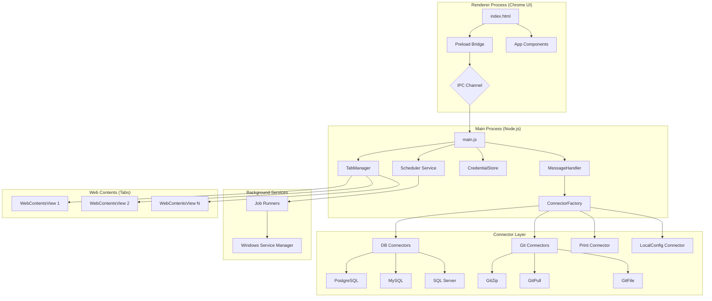
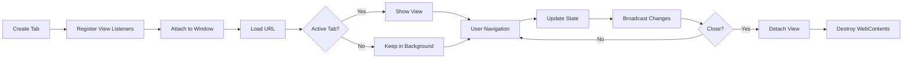
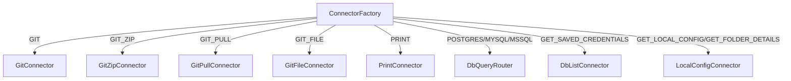
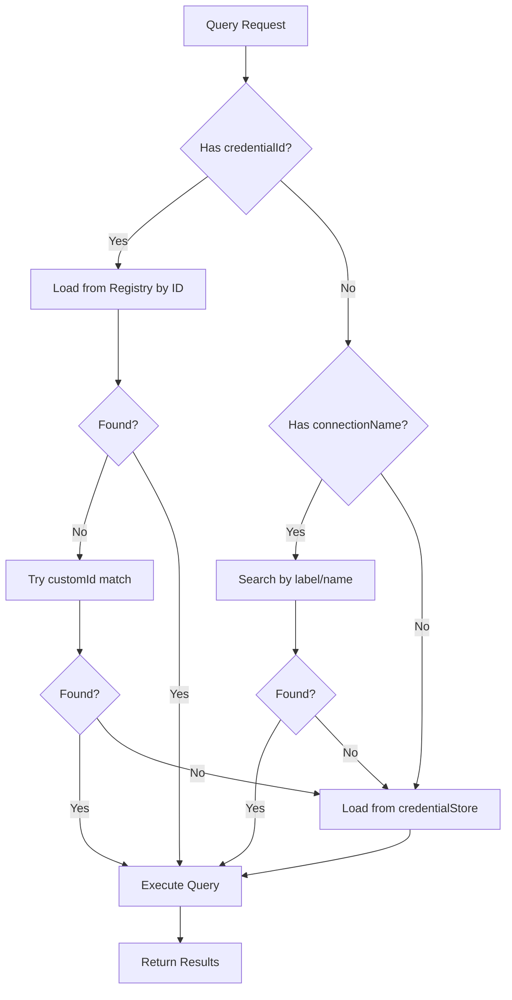
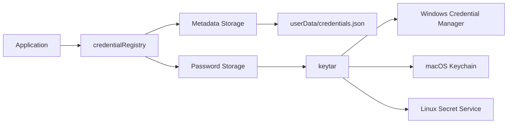
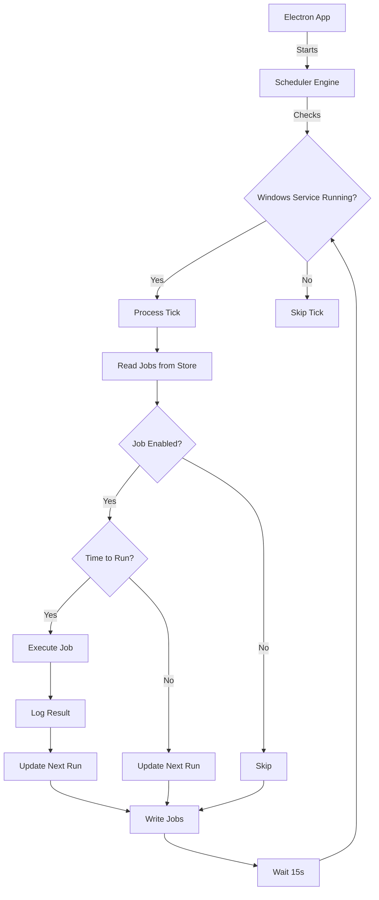
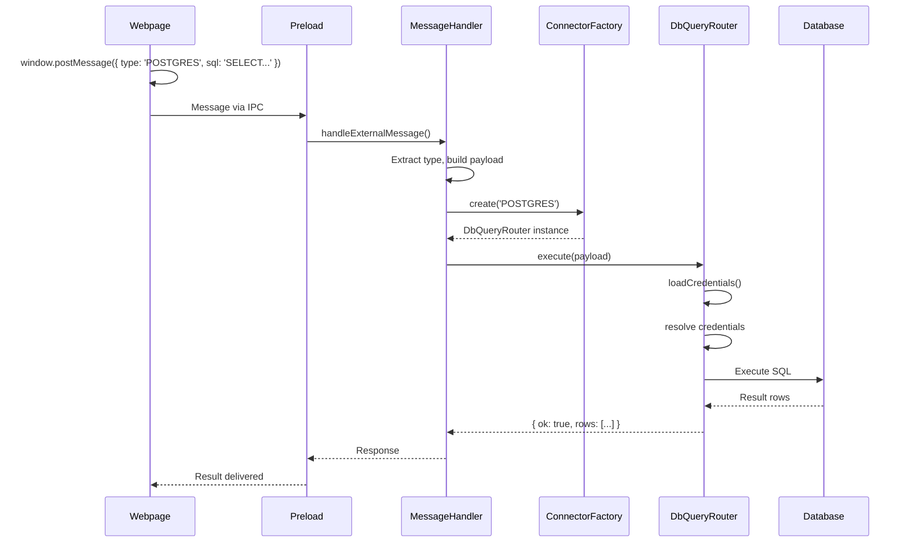
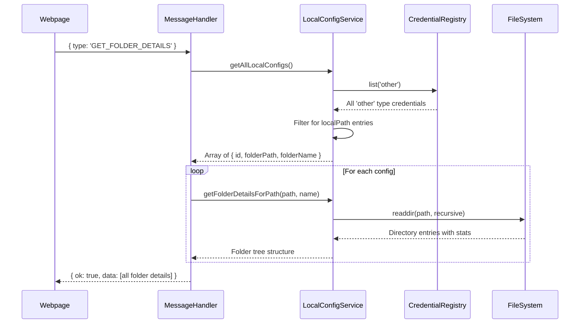

# MoBrowser Project - Deep Architecture Analysis

## Executive Summary

**MoBrowser** (also known as MuulBrowser) is a sophisticated, developer-centric Electron-based browser that goes far beyond standard web browsing. It integrates a powerful suite of developer utilities including database connectors, Git synchronization, printer support, and a background task scheduler that can run as a Windows service.

**Production Readiness**: 68/100 (Developer Preview phase)

---

## System Architecture Overview

### Technology Foundation
- **Framework**: Electron v33.2.0
- **Runtime**: Node.js (ES6+ with async/await)
- **UI**: HTML5, CSS3, JavaScript (no framework - vanilla JS)
- **Process Model**: Multi-process architecture (Main + Renderer + Preload)

### Architecture Diagram



---

## Core Components Analysis

### 1. Main Process (`src/main/main.js`)

**Role**: Central coordinator for the entire application

**Key Responsibilities**:
- Window lifecycle management (create, minimize, maximize, close)
- Tab orchestration via TabManager
- Deep-link handling and multi-instance coordination
- GitHub OAuth flow monitoring
- Theme management and broadcasting
- Auxiliary window controllers (bookmarks, settings, credentials, etc.)
- Update management via electron-updater

**Important Patterns**:
- **Multi-window support**: Allows "New Window" actions without single-instance lock
- **Deep-link handling**: Processes `http(s)://` URLs from command-line arguments
- **Theme broadcasting**: Centralized theme state synchronized across all windows
- **GitHub tab tracking**: Special handling for GitHub authentication flows

**Size**: 1393 lines, 71 functions/code blocks

---

### 2. Tab Manager (`src/main/tabManager.js`)

**Architecture**: Modern WebContentsView-based multi-tab system

**Why WebContentsView over BrowserView**:
- Better performance through improved compositing
- More reliable bounds management
- Modern Electron API (BrowserView is legacy)

**Key Features**:
- Tab creation, destruction, activation, reordering
- Navigation controls (back, forward, reload)
- Tab pinning and context menu actions
- DevTools management (per-tab and chrome DevTools)
- Zoom controls with limits
- History recording and tracking
- "Reopen closed tab" functionality (stack limit: 50)
- HTML5 fullscreen support
- Save page functionality
- View source capability

**Tab Lifecycle**:


**Size**: 850 lines, 60+ methods

---

### 3. Message Handler (`src/main/messageHandler.js`)

**Role**: Central IPC message router for external webpage communication

**Architecture**: Receives messages from web pages (via `window.postMessage`), validates them, and routes to appropriate connectors

**Supported Message Types**:

| Type | Handler | Purpose |
|------|---------|---------|
| `MUULORIGIN` | Direct | Handshake verification for trusted sites |
| `PING` | Direct | Health check for MuuLogin domains |
| `EXECUTE_REMOTE_QUERY` | Direct → DbQueryRouter | Database query execution |
| `GET_LOCAL_CONFIG` | Direct → LocalConfigService | Retrieve all local folder configs |
| `GET_FOLDER_DETAILS` | Direct → LocalConfigService | List folder contents for all configs |
| `GIT`, `GIT_ZIP`, `GIT_PULL`, `GIT_FILE` | ConnectorFactory → Git connectors | Git operations |
| `PRINT` | ConnectorFactory → PrintConnector | Printing operations |
| `POSTGRES`, `MYSQL`, `SQLSERVER` | ConnectorFactory → DbQueryRouter | Database queries |
| `GET_SAVED_CREDENTIALS` | ConnectorFactory → DbListConnector | Credential enumeration |

**Direct Handling Pattern**:
- For `GET_LOCAL_CONFIG` and `GET_FOLDER_DETAILS`, the message handler directly instantiates `LocalConfigService` instead of going through `ConnectorFactory`
- This was a recent refactoring (see conversation 5147f7ce) to support multiple local configs via credential registry

**Security Consideration**:
> **WARNING**: Currently lacks strict origin filtering. Any webpage can potentially access local database connectors if they know the message format. This is a known security gap (README mentions "68/100" production readiness).

---

### 4. Connector Factory Pattern (`src/main/connectors/ConnectorFactory.js`)

**Design Pattern**: Factory pattern for creating appropriate connector instances based on message type

**Architecture**:
```javascript
ConnectorFactory.create(type) → Connector Instance
```

**Connector Map**:



**Base Connector Interface**:
```javascript
class BaseConnector {
  async execute(payload) {
    // Override in subclass
  }
}
```

**Benefits**:
- Decoupled message handling from business logic
- Easy to extend with new connector types
- Consistent interface across all connectors
- Testable in isolation

---

### 5. Database Query System

#### DbQueryRouter (`src/main/connectors/DbQueryRouter.js`)

**Role**: Routes database queries to appropriate database-specific connectors

**Supported Databases**:
- PostgreSQL (via `pg` package)
- MySQL (via `mysql2` package)
- SQL Server (via `mssql` package)

**Credential Resolution Flow**:


**Special Handling**:
- `CREATE DATABASE` statements: Automatically switches to system database (e.g., `postgres`)
- Dynamic database selection: Message can override stored credential database
- Parameter support for prepared statements

#### Individual Query Connectors

- **PostgresQueryConnector**: Uses `pg` Pool for connection management
- **MysqlQueryConnector**: Uses `mysql2` with promise interface
- **SqlServerQueryConnector**: Uses `mssql` with connection pooling

---

### 6. Local Config System

#### LocalConfigService (`src/main/LocalConfigService.js`)

**Purpose**: Manages local folder configuration for file browsing functionality

**Data Sources** (in order of precedence):
1. **Credential Registry** (`credentialRegistry.js`): Primary source - stores multiple local configs
2. **local-config.json**: Legacy fallback in userData directory

**Key Methods**:

| Method | Purpose | Returns |
|--------|---------|---------|
| `getLocalConfig()` | Get first/legacy local config | `{ folderPath, folderName }` |
| `getAllLocalConfigs()` | Get all configured folders | Array of configs with IDs |
| `getFolderDetails()` | List contents of legacy config folder | Folder structure |
| `getFolderDetailsForPath()` | Recursive folder listing | Nested folder tree |

**Recursive Folder Listing**:
- Max depth: 10 levels
- Skips `node_modules` and `.git` for performance
- Returns full tree structure with file sizes
- Sorts: folders first, then files (alphabetically)

---

### 7. Credential Management

#### credentialStore.js
- **Purpose**: Local file-based credential storage (legacy)
- **Location**: `userData/db-config.json`
- **Encryption**: Uses `keytar` for password storage in OS keychain

#### credentialRegistry.js
- **Purpose**: Unified credential registry supporting multiple entries
- **Types**: `database`, `git`, `other`
- **Features**: 
  - CRUD operations with unique IDs
  - Type-based filtering
  - Custom ID support for external integrations
  - Integration with OS-level secure storage via `keytar`

#### Security Architecture


---

### 8. Git Integration

**GitHub Manager** (`src/main/githubManager.js`):
- OAuth token management via OS keychain
- Repository operations (create, push, pull)
- File uploads and downloads
- Branch management
- Zip archive creation and upload

**Git Connectors**:
- **GitConnector**: Basic Git operations
- **GitZipConnector**: Create and upload zip archives (supports local, GitHub, or both)
- **GitPullConnector**: Pull/download operations
- **GitFileConnector**: Individual file operations

**Authentication Flow**:
1. User clicks GitHub button → Opens github.com/login
2. GitHub OAuth redirects with token in URL fragment
3. Tab navigation listener detects token
4. Token stored in OS keychain via `keytar`
5. Subsequent operations use stored token

---

### 9. Scheduler Service (`src/main/scheduler/`)

**Purpose**: Background task execution engine that can run as a Windows service

**Architecture Components**:
- **serviceEngine.js**: Main scheduler loop
- **jobsStore.js**: Job persistence (JSON file in userData)
- **logStore.js**: Execution logging with rotation
- **jobRunnerFactory.js**: Creates appropriate runner for job type
- **schedule.js**: Cron expression parsing

**Job Types** (via runners):
- Database queries
- File downloads
- Git sync operations
- Custom scripts

**Service Integration**:


**Service Check**:
- Windows: Queries `sc.exe` for service status
- Non-Windows: Always returns true (development mode)

---

### 10. Preload Bridge (`src/preload.js`)

**Role**: Secure IPC bridge between renderer and main process

**Security Model**:
- **Context Isolation**: Enabled (renderer cannot access Node.js directly)
- **Context Bridge**: Exposes whitelisted APIs to renderer via `window.browserBridge`

**Exposed APIs** (161 functions total):

**Tab Management**:
- `createTab()`, `activateTab()`, `closeTab()`, `moveTab()`
- `pinTab()`, `setTabPinned()`, `closeOtherTabs()`, `closeTabsToRight()`

**Navigation**:
- `navigate()`, `reload()`, `goBack()`, `goForward()`

**Bookmarks & History**:
- `getBookmarks()`, `saveBookmark()`, `removeBookmark()`, `toggleBookmark()`
- `getHistory()`, `clearHistory()`

**GitHub**:
- `githubGetConfig()`, `githubSaveConfig()`, `githubSignOut()`
- `openGithubLoginTab()`

**Credentials**:
- `openCredentialManager()`, `closeCredentialManager()`

**Updates**:
- `checkForUpdates()`, `installUpdate()`, `onUpdateStatus()`

**Window Controls**:
- `minimize()`, `maximize()`, `restore()`, `close()`
- `quitApp()`

**Popups**:
- Settings, Git, Bookmarks, Security, Suggestions, Profile, Downloads

**Event Listeners**:
- Tab state changes, theme updates, handshake status, download progress

---

### 11. Renderer Process (`src/renderer/`)

**UI Structure**:
- **index.html**: Main chrome shell (421 lines)
- **scripts/**: UI logic modules
- **assets/**: Styles, icons, fonts

**Key UI Components**:

**Tab Strip**:
- Draggable tabs with reordering
- Favicon display
- Active tab highlighting
- Close buttons
- New tab button
- Window controls (minimize, maximize, close)

**Address Bar**:
- Security indicator (lock icon)
- URL input with suggestions
- Bookmark star
- Centered version on new tab page

**Toolbar**:
- Navigation buttons (back, forward, reload)
- Handshake badge (Codex verification)
- Profile button
- Downloads button
- GitHub button
- Settings menu
- AI Chat toggle

**Hero Section** (New Tab):
- MoBrowser branding
- Search input
- Shortcut grid (customizable)
- Featured apps showcase (Credential Manager, Downloads, Print Studio, Git Sync, Data Vault, Bookmarks)

**Modals**:
- Shortcut editor
- Bookmark editor
- Chat drawer

**Auxiliary Windows** (separate BrowserWindows):
- Bookmarks manager
- Git sync panel
- Settings
- Credential manager
- Credential form
- Security popover
- Profile manager
- Downloads manager
- Scheduler manager

---

## Data Flow Analysis

### Webpage → Database Query Flow



### Local Config → Folder Listing Flow



---

## Technology Stack

### Core Dependencies

**Electron Ecosystem**:
- `electron`: ^33.2.0 - Desktop framework
- `electron-builder`: ^26.0.12 - Build and packaging
- `electron-updater`: ^6.7.3 - Auto-update functionality
- `electron-log`: ^5.4.3 - Logging system

**Database Drivers**:
- `pg`: ^8.13.0 - PostgreSQL
- `mysql2`: ^3.13.0 - MySQL/MariaDB
- `mssql`: ^12.2.0 - SQL Server
- `sqlite3`: ^5.1.7 - SQLite
- `mongodb`: ^6.10.0 - MongoDB

**Git & Remote**:
- `@aws-sdk/rds-signer`: ^3.972.0 - AWS RDS IAM authentication
- `ssh2`: ^1.17.0 - SSH tunneling for remote connections

**Security**:
- `keytar`: ^7.9.0 - OS-level credential storage

**Utilities**:
- `adm-zip`: ^0.5.16 - Zip archive creation
- `cron-parser`: ^4.9.0 - Cron expression parsing for scheduler

**Build Tools**:
- `pkg`: ^5.8.0 - Package headless service for distribution
- `babel`: For ES6+ transpilation in tests
- `jest`: ^30.2.0 - Testing framework

### UI Technologies

**Styling**:
- Vanilla CSS with custom properties (CSS variables)
- Two included skins: `classic.css`, `glass.css`
- Responsive design with DPI scaling awareness

**Fonts**:
- `@fontsource/roboto`: Primary font
- `@fontsource/material-icons`: Icon system

**No UI Framework**: Pure JavaScript, no React/Vue/Angular
- Keeps bundle size small
- Faster startup time
- Full control over rendering

---

## Architecture Patterns & Design Decisions

### 1. **Connector Pattern**
- **Why**: Decouples message handling from business logic
- **Benefit**: Easy to add new integrations without modifying core message handler
- **Trade-off**: More files and classes to maintain

### 2. **Direct Service Instantiation for Local Config**
- **Recent Change**: `GET_LOCAL_CONFIG` and `GET_FOLDER_DETAILS` bypass ConnectorFactory
- **Why**: Simplified flow for actions that don't need connector abstraction
- **Context**: Refactored in conversation 5147f7ce-f642-43ab-877e

### 3. **WebContentsView over BrowserView**
- **Why**: Modern API with better performance
- **Migration**: Moved from legacy BrowserView
- **Benefit**: Better compositing, more reliable bounds management

### 4. **Credential Registry + Legacy Store**
- **Pattern**: Dual storage with registry as primary, file as fallback
- **Why**: Migration path from old to new system
- **Future**: Could deprecate file-based storage entirely

### 5. **Windows Service Capability**
- **Pattern**: Same codebase can run as app or service
- **Implementation**: Service engine checks if Windows service is running
- **Benefit**: Background task execution even when app is closed

### 6. **Multi-Instance Support**
- **Decision**: No single-instance lock enforcement
- **Why**: Supports "New Window" action
- **Trade-off**: Multiple processes can run simultaneously

---

## Security Analysis

### Current Security Measures ✅

1. **Credential Encryption**: Passwords stored in OS keychain via `keytar`
2. **Context Isolation**: Renderer cannot access Node.js APIs directly
3. **Preload Whitelisting**: Only specific APIs exposed to renderer
4. **Content Security Policy**: Defined in index.html
5. **Session Isolation**: GitHub tokens cleared on logout

### Known Security Gaps ⚠️

1. **No Origin Filtering**: MessageHandler accepts `window.postMessage` from ANY webpage
   - **Risk**: Malicious sites could query local databases if they know the message format
   - **Recommended Fix**: Whitelist trusted origins or require explicit user authorization

2. **MUULOGIN_HOSTS Hardcoded**: Only checks `muulogin.mycompany.com` for PING
   - **Risk**: Limited utility without configurable trusted domains
   - **Recommended Fix**: User-configurable trusted domain list

3. **No Audit Logging**: Database credential access not logged
   - **Risk**: No forensic trail if credentials are compromised
   - **Recommended Fix**: Local-only audit log (README mentions this as roadmap item)

### Production Hardening Roadmap (from README)

1. **Origin Hardening**: Implement whitelist for SQL bridge access
2. **Audit Logs**: Log whenever database credentials are accessed
3. **Multi-Platform Services**: Extend scheduler to macOS (launchd) and Linux (systemd)

---

## File Organization

```
mobrowser/
├── build/                      # Icons and installer scripts
│   ├── icon.ico               # App icon
│   └── installer.nsh          # NSIS installer customization
│
├── scheduler-service/          # Windows service wrapper
│   └── (Service installation scripts)
│
├── service-runner/             # Headless service entry point
│   └── index.js               # pkg-compatible entry point
│
├── scripts/                    # Build utilities
│   └── ensure-cpu-features-stub.js
│
├── src/
│   ├── logger.js              # Application-wide logger
│   ├── preload.js             # Main preload script (407 lines)
│   │
│   ├── main/                   # Main Process
│   │   ├── main.js            # Entry point (1393 lines)
│   │   ├── tabManager.js      # Tab lifecycle (850 lines)
│   │   ├── messageHandler.js  # IPC router (243 lines)
│   │   ├── LocalConfigService.js  # Folder config (244 lines)
│   │   ├── githubManager.js   # GitHub integration (24KB)
│   │   ├── credentialStore.js
│   │   ├── credentialRegistry.js
│   │   ├── bookmarkStore.js
│   │   ├── historyStore.js
│   │   ├── themeStore.js
│   │   ├── printerController.js
│   │   ├── chatService.js
│   │   │
│   │   ├── connectors/        # Pluggable service layer
│   │   │   ├── BaseConnector.js
│   │   │   ├── ConnectorFactory.js
│   │   │   ├── DbQueryRouter.js       # DB routing (122 lines)
│   │   │   ├── PostgresQueryConnector.js
│   │   │   ├── MysqlQueryConnector.js
│   │   │   ├── SqlServerQueryConnector.js
│   │   │   ├── DbListConnector.js
│   │   │   ├── GitConnector.js
│   │   │   ├── GitZipConnector.js
│   │   │   ├── GitPullConnector.js
│   │   │   ├── GitFileConnector.js
│   │   │   ├── PrintConnector.js      # Thermal printer (30KB)
│   │   │   └── LocalConfigConnector.js
│   │   │
│   │   ├── scheduler/         # Background task engine
│   │   │   ├── serviceEngine.js
│   │   │   ├── jobsStore.js
│   │   │   ├── logStore.js
│   │   │   ├── jobRunnerFactory.js
│   │   │   ├── jobBuilder.js
│   │   │   ├── schedule.js
│   │   │   ├── paths.js
│   │   │   └── runners/
│   │   │       ├── dbQueryRunner.js
│   │   │       ├── downloadRunner.js
│   │   │       └── ...
│   │   │
│   │   ├── windows/           # Auxiliary window controllers
│   │   │   ├── bookmarkWindow.js
│   │   │   ├── credentialWindow.js
│   │   │   ├── gitWindow.js
│   │   │   ├── settingsWindow.js
│   │   │   ├── securityPopoverWindow.js
│   │   │   ├── suggestionsWindow.js
│   │   │   ├── profileManager.js
│   │   │   ├── downloadsWindow.js
│   │   │   └── schedulerWindow.js
│   │   │
│   │   ├── contextMenu/
│   │   │   └── contextMenu.js
│   │   │
│   │   └── shortcuts/         # Keyboard shortcuts
│   │       ├── index.js
│   │       ├── tabShortcuts.js
│   │       └── devShortcuts.js
│   │
│   ├── preload/               # Additional preload scripts
│   │   └── bridges/
│   │       └── chatBridge.js
│   │
│   └── renderer/              # UI Chrome Shell
│       ├── index.html         # Main UI (421 lines)
│       │
│       ├── assets/
│       │   ├── styles/
│       │   │   ├── main.css
│       │   │   └── fonts-loader.js
│       │   ├── skins/
│       │   │   ├── classic.css
│       │   │   └── glass.css
│       │   └── icons/
│       │       └── mono.svg
│       │
│       ├── scripts/
│       │   ├── app.js         # Main renderer logic
│       │   ├── components/
│       │   │   ├── themeToggle.js
│       │   │   ├── windowControls.js
│       │   │   └── ...
│       │   └── utils/
│       │
│       ├── bookmarks/
│       ├── github/
│       ├── credentials/
│       ├── credentialManager/
│       ├── settings/
│       ├── profile/
│       ├── downloads/
│       ├── scheduler/
│       ├── history/
│       ├── suggestions/
│       ├── security/
│       ├── tabmenu/
│       ├── dialog/
│       ├── theme/
│       └── chat/
│
├── test/                      # Jest tests
│   └── (Test files)
│
└── vendor/                    # Native dependency stubs
    └── cpu-features-stub/     # Workaround for ARM64 builds
```

---

## Key Insights for Development

### 1. **Adding a New Connector**

**Steps**:
1. Create connector class extending `BaseConnector`
2. Implement `execute(payload)` method
3. Add case to `ConnectorFactory.create()` switch statement
4. (Optional) Add direct handling in `messageHandler.js` if connector-less

**Example**:
```javascript
// src/main/connectors/MyConnector.js
const BaseConnector = require('./BaseConnector');

class MyConnector extends BaseConnector {
  async execute(payload) {
    // Your logic here
    return { ok: true, data: result };
  }
}

module.exports = MyConnector;

// Update ConnectorFactory.js
case 'MY_ACTION':
  return new MyConnector();
```

### 2. **Adding a New IPC Handler**

**Preload Side**:
```javascript
// In src/preload.js
contextBridge.exposeInMainWorld('browserBridge', {
  // ... existing methods
  myNewMethod(arg) {
    return ipcRenderer.invoke('my-new-channel', arg);
  }
});
```

**Main Side**:
```javascript
// In src/main/main.js or separate controller
ipcMain.handle('my-new-channel', async (event, arg) => {
  // Your logic
  return result;
});
```

**Renderer Side**:
```javascript
// In renderer scripts
const result = await window.browserBridge.myNewMethod(arg);
```

### 3. **Adding a Scheduler Job Type**

**Steps**:
1. Create runner in `src/main/scheduler/runners/`
2. Implement `run(job, context)` method
3. Register in `jobRunnerFactory.js`

### 4. **Testing Database Connectors**

**Current State**: Jest configured but test coverage is minimal

**Test Locations**: `test/` directory

**Running Tests**:
```bash
npm test              # Run all tests
npm run test:coverage # With coverage report
```

### 5. **Multi-Database Support Pattern**

The `DbQueryRouter` demonstrates a clean pattern for supporting multiple databases:

1. **Normalization**: Convert various DB type names to canonical form
2. **Credential Resolution**: Flexible lookup by ID, customId, or name
3. **Engine Selection**: Route to appropriate connector
4. **Special Cases**: Handle edge cases like `CREATE DATABASE`

This pattern could be extended to support additional databases (e.g., SQLite via better-sqlite3, MongoDB queries, etc.)

---

## Notable Recent Changes

From conversation `5147f7ce-f642-43ab-877e`:

**Refactored Local Config Handling**:
- **Before**: Single local-config.json file
- **After**: Multiple configs stored in credential registry
- **Impact**: `GET_LOCAL_CONFIG` and `GET_FOLDER_DETAILS` now return arrays
- **Breaking**: Webpages expecting single config object need updates

---

## Production Readiness Assessment

### Strengths (92+ score areas)

✅ **Excellent Architecture**: Clean separation of concerns, extensible connector pattern  
✅ **Feature Complete**: Database, Git, scheduler, printing all functional  
✅ **Modern Electron**: Uses latest APIs (WebContentsView, not deprecated BrowserView)  
✅ **Service Capability**: Can run as background Windows service  
✅ **Auto-Updates**: electron-updater integration  

### Weaknesses (45-65 score areas)

⚠️ **Security (45%)**: No origin filtering on message handler - CRITICAL BLOCKER  
⚠️ **Stability (65%)**: DPI scaling issues, hitbox problems on 1080p laptops  
⚠️ **Testing**: Minimal test coverage  
⚠️ **Documentation**: Inline code comments sparse in some areas  
⚠️ **Multi-Platform**: Scheduler service Windows-only  

---

## Recommendations for Future Development

### Immediate Priorities (Security)

1. **Implement Origin Whitelisting**:
   ```javascript
   // In messageHandler.js
   const TRUSTED_ORIGINS = ['https://trusted-site.com', 'https://muulorigins.com'];
   
   if (!TRUSTED_ORIGINS.includes(senderOrigin)) {
     return { ok: false, error: 'Untrusted origin' };
   }
   ```

2. **Add Credential Access Auditing**:
   - Log to `userData/audit.log` whenever credentials accessed
   - Include timestamp, credential ID, action, origin

3. **Require User Approval for DB Queries**:
   - First-time domain prompts user for permission
   - Store approved domains in user preferences

### Code Quality Improvements

1. **Add JSDoc Comments**: Especially in complex files like `tabManager.js`, `githubManager.js`
2. **Increase Test Coverage**: Target 70%+ coverage
3. **Extract Magic Numbers**: `CLOSED_TAB_STACK_LIMIT`, timeout values, etc. to constants file
4. **Error Handling**: More granular error types, better error messages

### Feature Enhancements

1. **SQLite Support**: Add SQLiteQueryConnector (currently has driver but no connector)
2. **MongoDB Query Support**: Currently only has driver, no query interface
3. **SSH Tunnel UI**: `ssh2` is included but no UI for tunnel management
4. **Cross-Platform Scheduler**: Implement for macOS and Linux

### Performance Optimizations

1. **Lazy Load Connectors**: Only `require()` connector when first used
2. **Connection Pooling**: Reuse database connections across queries
3. **Credential Caching**: Cache decrypted credentials for session duration

---

## Conclusion

MoBrowser is an impressively architected developer browser with a clean, extensible design. The connector pattern is well-executed, the tab management is modern, and the feature set is comprehensive. The primary blocker to production is the **security gap in origin filtering**, which is acknowledged and has a clear remediation path.

The codebase is well-organized and would be straightforward to extend with new connectors, IPC handlers, or UI components. The recent refactoring of local config handling demonstrates active maintenance and thoughtful evolution of the architecture.

**Overall Assessment**: Strong foundation with clear path to production readiness through focused security hardening.
